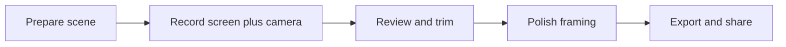

# DemoHero product plan: use cases

## Product in one sentence

**DemoHero** is a Mac-native recorder that captures the screen, camera, and voice together, then turns that take into a watchable product-demo video in minutes.

It sits next to Screen Studio: not a general screen-capture utility (CleanShot), not an async team messenger (Loom), and not a full timeline editor (Camtasia / ScreenFlow). The job is *make this product look good on camera*.

## North star

DemoHero exists to help people **ship public product demos** — launch clips, changelog videos, landing-page loops, and “what we just shipped” walkthroughs.

It is not a Loom-style async chat tool. It is not a Camtasia/ScreenFlow course editor. Internal walkthroughs, help-center clips, and sales demos can reuse the same capture engine later; they do not define v1.

## Who it is for

Primary users are people who need to *show software in motion* and be present in the video:

- **Indie founders and product builders** recording a launch clip, landing-page loop, or “what we just shipped” walkthrough.
- **PMs, designers, and marketers** turning a feature into a changelog, website, or social clip.
- **Developers and educators** recording a short tutorial where the face and the UI both matter.

Secondary users (same product, later emphasis): support/success creating help-center walkthroughs; sales creating a personalized demo for one prospect.

## Job to be done

When I need to show how a product works, I want to record my screen and myself in one take and export a polished video, so viewers follow the action without me opening a video editor.

Success looks like: record once, trim a few seconds, export, paste or upload. Failure looks like: QuickTime rawness, OBS setup tax, or “I’ll do it in Final Cut later” and never shipping the clip.

## Competitive frame

- **Screen Studio** — closest analog. Camera overlay, branded frame, export presets, and automatic polish. DemoHero should match this *job*, not copy every feature.
- **Loom** — faster share-a-link for coworkers; looks like a meeting recording, not a product film.
- **CleanShot / QuickTime** — capture is easy; the output is unproduced.
- **OBS / ScreenFlow / Camtasia** — powerful, slow, and overkill for a 60-second demo.

**Wedge:** DemoHero is for *shipping a demo video*, with screen + camera as first-class, not an afterthought overlay.

---

## V1 use cases (locked)

V1 must win these five cases. If a feature does not serve one of them, it waits.

### UC-1 — Record a product demo in one take

**Actor:** founder, PM, or designer.
**Trigger:** a feature is ready and needs a video for the site, changelog, launch tweet, or investor update.
**Flow:** pick a display or window, turn camera and mic on, optionally capture system audio (product sounds / video in the app), hit record, narrate while clicking through, stop.
**Outcome:** one synchronized take with screen, camera, and audio ready to trim; the user does not manually align recordings.
**Why it matters:** this is the core promise. Recording screen and camera in separate apps and synchronizing them by hand is the pain we remove.

### UC-2 — Be on camera without covering the product

**Actor:** same.
**Trigger:** the demo needs a human face for trust, but the UI is the star.
**Flow:** optionally turn on **Show presenter on screen** before recording; place the live circle or square on the capture so it does not cover the click target. The bubble is recorded as part of the screen.
**Outcome:** face stays visible in the take; important UI stays readable. Placement is chosen while recording, not in the editor.
**Why it matters:** the presenter is part of the capture the viewer sees, without a second camera layer in the editor.

### UC-3 — Make a 30–90s launch or feature clip look produced

**Actor:** builder shipping a public video.
**Trigger:** raw capture looks amateur: tiny cursor, no focus, desktop clutter, mismatched aspect ratio.
**Flow:** after stop, the take opens in a simple editor: trim dead air, speed up a slow stretch, add padding/background. V1 exports 16:9; vertical reflow is v1.x.
**Outcome:** a clip that looks intentional, not a meeting recording.
**Why it matters:** people compare output quality to Screen Studio, not to QuickTime.

### UC-4 — Capture only the product, not the whole Mac

**Actor:** anyone demoing an app that is not full-screen.
**Trigger:** notifications, messy desktop, other windows, or a giant 5K display would leak into the video.
**Flow:** choose full display, a single window, or a region; optionally hide desktop icons; window capture stays on that app.
**Outcome:** the viewer sees the product, not the presenter’s life.
**Why it matters:** privacy and focus are table stakes for demo recording.

### UC-5 — Export and hand off in one step

**Actor:** the same person who recorded; there is no editor on staff.
**Trigger:** the clip needs to land in a browser, Notion, Twitter/X, LinkedIn, Slack, or a landing page.
**Flow:** choose 720p, 1080p, or 4K, export MP4, then copy it or reveal it in Finder.
**Outcome:** a file that is the right size, aspect, and quality without a settings rabbit hole.
**Why it matters:** the product is not “a recording”; it is a *shipped demo*.

**V1 cut:** UC-1 through UC-5 with a record-time presenter bubble, trim, speed, framing, and MP4 export. Zoom and post-record camera overlay editing are not supported. Captions, GIF, and vertical reflow wait.

---

## Parked for v1.x+

Do not design v1 around these. They reuse the same engine after the primary loop is excellent.

### UC-6 — Short tutorial or “how to” for a specific task

Keyboard-shortcut overlay and cursor emphasis so a 2–5 minute how-to is followable on a phone. Distinct from a marketing demo: more clicks, more instruction, still not a course LMS.

### UC-7 — Internal walkthrough for teammates

A PM records “here is the new settings page” for Slack/Linear. Needs speed and a decent look; does *not* need Loom comments, viewer analytics, or workspace accounts in v1.

### UC-8 — Help-center / docs clip

Support or docs records a 45-second path (“reset your API key”). Needs window capture, no desktop leak, captions later, easy re-export when the UI changes.

### UC-9 — Personalized sales demo

AE records a 2-minute walkthrough named for one prospect. Same capture pipeline; later: templates, intro slate, logo. Not a call recorder.

### UC-10 — Social / vertical remix

One landscape recording re-exported as 9:16 with camera layout adapted. High leverage once vertical framing exists; weak if v1 cannot reframe.

**Also parked (not v1):** captions, GIF export, keyboard-shortcut overlay.

---

## Later / explicit non-goals

Do not pretend these are launch use cases:

- Live streaming (Twitch, YouTube Live, Stage Manager + OBS scenes).
- Team async video OS (comments, folders, SSO, viewer funnel) — that is Loom.
- Long-form course production (multi-track, quizzes, SCORM) — that is Camtasia / ScreenFlow.
- Screenshot, scrolling capture, OCR, annotation — that is CleanShot.
- iPhone/iPad USB capture with device frames — valuable, after Mac screen+camera is great.
- Cloud collaboration as the product (accounts required to record). Recording should work fully offline; share links can come later.
- Manual or automatic zoom. DemoHero keeps the editor focused on trim, speed, and framing.
- Post-record camera overlay editing. Place the live presenter before you record; it is captured in the screen.

---

## End-to-end journeys (what “good” feels like)

### Journey A — Friday feature demo (must-win)

1. Open DemoHero from the menu bar.
2. Select a display, window, or region; choose camera, mic, optional system audio, and whether to show the live presenter; click Record for the 3-second countdown.
3. Narrate a 75-second click-through.
4. Stop; editor opens on the take. Trim the false start. Adjust speed or the frame if needed.
5. Export 720p (or 1080p/4K with Pro); drag the MP4 onto the changelog.

Time-to-ship target: **under 10 minutes** from first click to a file they are willing to post.

### Journey B — Founder on camera, UI never covered

1. Record full screen with camera on and **Show presenter on screen** enabled.
2. Before and during the take, drag and resize the live presenter so it does not cover the click target.
3. Stop. The editor shows the screen as recorded, including the presenter bubble.
4. Export. Face is in the video; no control is hidden.

### Journey C — Same take, two formats (v1.x)

1. Record 16:9 for the website.
2. Switch output to vertical; camera and frame layout reflow.
3. Export a second file for Shorts / Reels / LinkedIn.

---

## Capabilities implied by the use cases

These are product requirements derived from the cases above, not an engineering spec.

| Need | Comes from | When |
| --- | --- | --- |
| Screen + camera + mic (+ optional system audio) in one take | UC-1 | v1 |
| Display / window / region sources | UC-4 | v1 |
| Live presenter bubble placed before record and captured in the screen | UC-2 | v1 |
| Lightweight editor: trim, cut, speed | UC-3 | v1 |
| Framed output: padding, background, 16:9 aspect | UC-3 | v1 |
| Export presets and clipboard (MP4) | UC-5 | v1 |
| Local-only media | UC-4, UC-8 | v1 |
| Captions, GIF, vertical reflow | UC-3, UC-6, UC-10 | v1.x+ |

## How we know the plan is right

- A first-time user can complete Journey A without a tutorial.
- Output is compared to Screen Studio / Loom on *watchability*, not feature count.
- People use it for **public demos** first (site, social, changelog), not only internal Slack videos.
- Re-recording a demo after a UI tweak feels cheap enough that they actually do it.

## Out of this document

Stack, task order, and agent protocol live in [IMPLEMENTATION.md](IMPLEMENTATION.md). App Store pricing, product IDs, and the first-submission checklist live in [APP_STORE_RELEASE.md](APP_STORE_RELEASE.md).
